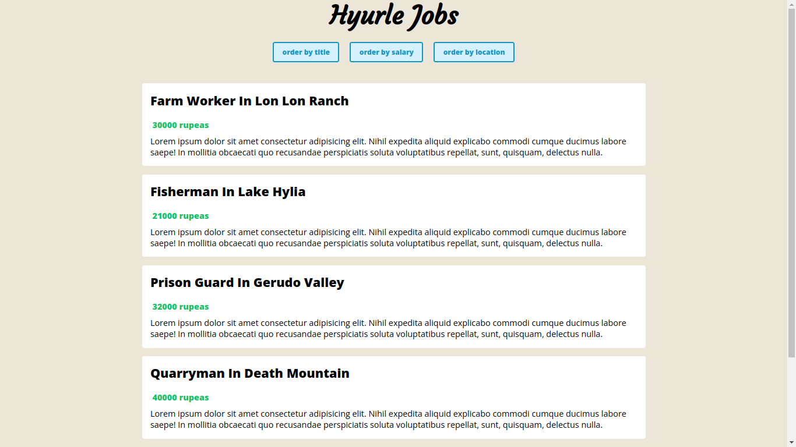

# VueJS & TypeScript - Hyurle Jobs APP | @rof1yev



## Transfer the project to yourself | Setup

### Copy project files to yourself

```sh
git clone repo_url
```

### Download all dependencies

```sh
npm install
```

### Open the project in the browser

```sh
npm run dev
```
